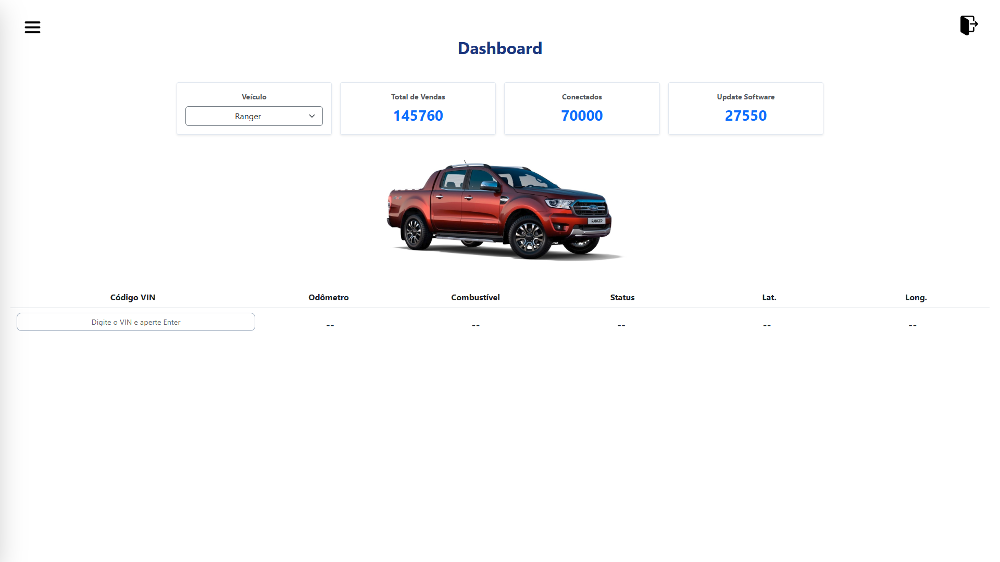

<div align="center">

# 🚗 Portal do Proprietário Ford

### Sistema web desenvolvido em Angular para gerenciamento e consulta de informações dos veículos Ford.

<p>
  
  
  
  
</p>

<p>
Projeto desenvolvido como desafio prático utilizando Angular, com foco em autenticação, proteção de rotas e construção de um dashboard responsivo.
</p>

</div>

---

# 📑 Índice

- [📖 Sobre o Projeto](#-sobre-o-projeto)
- [✨ Funcionalidades](#-funcionalidades)
- [🛠 Tecnologias Utilizadas](#-tecnologias-utilizadas)
- [📷 Demonstração](#-demonstração)
- [📂 Estrutura do Projeto](#-estrutura-do-projeto)
- [🚀 Como Executar](#-como-executar)
- [🧠 Conceitos Aplicados](#-conceitos-aplicados)
- [👨‍💻 Desenvolvedor](#-desenvolvedor)

---

# 📖 Sobre o Projeto

O **Portal do Proprietário Ford** é uma aplicação web desenvolvida em **Angular 19** que simula um portal de atendimento ao proprietário de veículos Ford.

A aplicação permite que usuários autenticados acessem um ambiente exclusivo contendo um dashboard com indicadores, seleção de veículos e consulta de informações utilizando o código **VIN (Vehicle Identification Number)**.

Durante o desenvolvimento foram aplicados diversos conceitos fundamentais do Angular, incluindo:

- Componentização
- Roteamento
- Guards
- Responsividade
- Organização da arquitetura do projeto
- Manipulação de dados utilizando TypeScript

---

# ✨ Funcionalidades

✅ Login de usuários

✅ Autenticação

✅ Proteção de rotas com AuthGuard

✅ Página inicial

✅ Menu Hambúguer

✅ Dashboard

✅ Seleção do veículo

✅ Consulta utilizando código VIN

✅ Exibição de informações do veículo

✅ Logout

✅ Interface Responsiva

---

# 🛠 Tecnologias Utilizadas

| Tecnologia | Utilização |
|------------|------------|
| Angular 19 | Framework Front-end |
| TypeScript | Linguagem principal |
| Bootstrap 5 | Estilização |
| HTML5 | Estrutura |
| CSS3 | Estilos |
| Git | Controle de versão |
| GitHub | Hospedagem do projeto |

---

# 📷 Demonstração

## 🔐 Tela de Login

<p align="center">

</p>

---

## 🏠 Página Inicial

<p align="center">

</p>

---

## 📊 Dashboard

<p align="center">

</p>

---

# 📂 Estrutura do Projeto

```text
src
│
├── app
│   ├── guards
│   ├── models
│   ├── pages
│   │   ├── login
│   │   ├── home
│   │   └── dashboard
│   │
│   ├── services
│   ├── app.config.ts
│   ├── app.routes.ts
│   └── app.component.ts
│
├── assets
│
└── public
    └── imagens
```

---

# 🚀 Como Executar

### Clone o repositório

```bash
git clone https://github.com/brenocerqueira-dev/SprintAngular.git
```

### Entre na pasta

```bash
cd SprintAngular
```

### Instale as dependências

```bash
npm install
```

### Execute a aplicação

```bash
ng serve
```

### Abra o navegador

```
http://localhost:4200
```

---

# 🧠 Conceitos Aplicados

✔ Componentização

✔ Angular Router

✔ AuthGuard

✔ TypeScript

✔ Organização em Pages

✔ Organização em Models

✔ Bootstrap

✔ Layout Responsivo

✔ Estrutura SPA (Single Page Application)

✔ Navegação protegida

---

# 📈 Fluxo da Aplicação

```text
Login
   │
   ▼
Autenticação
   │
   ▼
Página Inicial
   │
   ▼
Dashboard
   │
   ├── Selecionar veículo
   ├── Consultar VIN
   ├── Visualizar informações
   └── Logout
```

---

# 💡 Aprendizados

Durante este projeto foi possível desenvolver conhecimentos sobre:

- Desenvolvimento de aplicações SPA utilizando Angular
- Organização de componentes reutilizáveis
- Controle de navegação entre páginas
- Proteção de rotas utilizando Guards
- Criação de interfaces modernas e responsivas
- Manipulação de dados utilizando TypeScript
- Versionamento de código com Git e GitHub

---

# 👨‍💻 Desenvolvedor

<div align="center">

### Breno Alexandre de Medeiros Cerqueira

Desenvolvedor Front-end em formação.

<p>

<a href="https://github.com/brenocerqueira-dev">

</a>

</p>

</div>

---

<div align="center">

### ⭐ Se este projeto foi interessante para você, deixe uma estrela no repositório!

</div>
